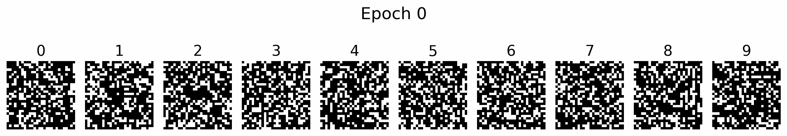

# talagrand_diffusion

A simple PyTorch implementation of a generative model on binary {0,1}⁷⁸⁴ pixels, inspired by the discrete diffusion framework in  
<p align="center">
  <strong>Talagrand's Convolution Conjecture and the Boolean Hypercube</strong> • <a href="https://arxiv.org/abs/2511.19374">arXiv:2511.19374</a>
</p>



> **Note**: This is an experimental implementation. Several design choices differ from the original theoretical construction in the paper.

> **Thanks**: Special thanks to Grok (xAI) — it helped me understand many key details of the paper.

### Citation

If you find this work useful, please cite the original paper:

```bibtex
@misc{chen2025talagrandsconvolutionconjectureloglog,
  title   = {Talagrand's convolution conjecture up to loglog via perturbed reverse heat},
  author  = {Yuansi Chen},
  year    = {2025},
  eprint  = {2511.19374},
  archivePrefix = {arXiv},
  primaryClass = {math.PR},
  url     = {https://arxiv.org/abs/2511.19374}
}
